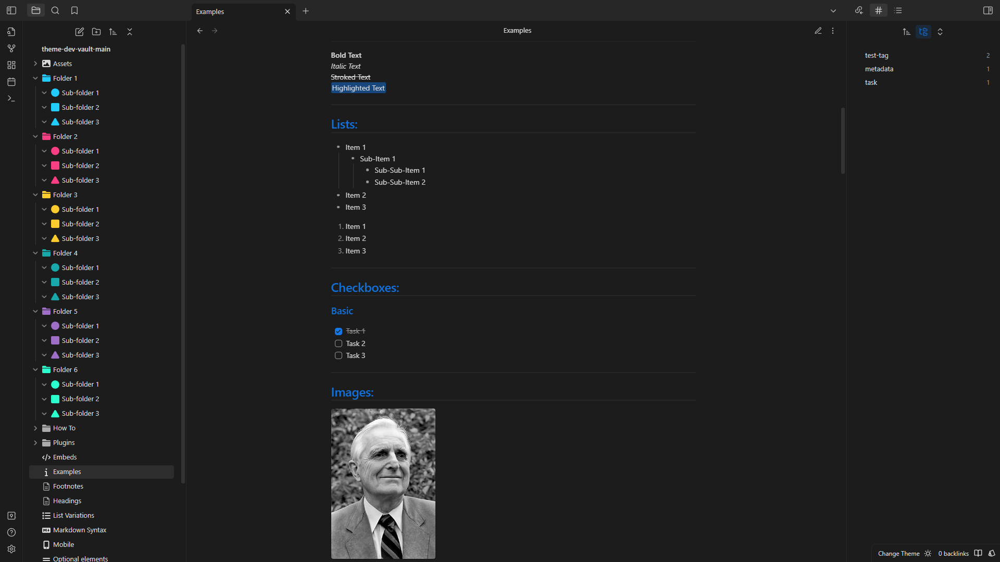

# Yue


This theme is a fork of [Things Theme](https://github.com/colineckert/obsidian-things) by [ Colin Eckert](https://github.com/colineckert).

Color scheme of this theme is from my Yue theme family.

## Screenshots:




Colorful icons in the screenshots are my [Obsidian Yue Icons](https://github.com/thegixo/YueObsidianIcons) which you can set by [Icon Folder](https://github.com/FlorianWoelki/obsidian-icon-folder) plugin.

## Features

- Subtle UI colors with vibrant syntax highlight colors
- Light and dark theme
- Quick preview/edit floating action button on mobile
- Customizable colors for bold, italic, highlighters, and block-quotes via the [Style Settings](https://github.com/mgmeyers/obsidian-style-settings) community plugin
- Enhanced code blocks with line numbers
- Tag pills for readability
- Checkbox styling and icons
- Better designed image cards
- [JetBrains Mono](https://www.jetbrains.com/lp/mono/) font and ligatures for code

## Supported Plugins

This theme has support for the following Obsidian community plugins (Things V1):

- [Sliding Panes (Andy's Mode)](https://github.com/deathau/sliding-panes-obsidian)
- [Calendar](https://github.com/liamcain/obsidian-calendar-plugin)
- [Kanban](https://github.com/mgmeyers/obsidian-kanban)
- [Hider](https://github.com/kepano/obsidian-hider)
- [Checklist](https://github.com/delashum/obsidian-checklist-plugin)
- [Style Settings](https://github.com/mgmeyers/obsidian-style-settings)
- [Advanced Mobile Toolbar](https://github.com/phibr0/obsidian-advanced-toolbar)

## Checkbox Styling

Things supports a wide number of alternate checkbox types. These allow you to call out tasks that are incomplete, canceled, rescheduled, etc. See below for availale checkbox types.


```
## Basic
- [ ] to-do
- [/] incomplete
- [x] done
- [-] canceled
- [>] forwarded
- [<] scheduling

## Extras
- [?] question
- [!] important
- [*] star
- ["] quote
- [l] location
- [b] bookmark
- [i] information
- [S] savings
- [I] idea
- [p] pros
- [c] cons
- [f] fire
- [k] key
- [w] win
- [u] up
- [d] down
```

## Installation

### Obsidian Marketplace (Recommended)

1. Open the **Settings** in Obsidian
1. Navigate to **Appearances** tab under **Options**
1. Under the **Themes** section, click on the `Manage` button across from **Themes**
1. Search for `Yue` in the Filter text input
1. Click `Use` and then you're done! 🎉

### Manual

1. Download this repo
1. Copy the `theme.css` file into your vault's `/.obsidian/themes` directory
1. Rename the file to `Yue.css` so it will have a unique name in the theme selection dropdown
1. Open the **Settings** in Obsidian
1. Navigate to **Appearances** tab under **Options**
1. Under the **Themes** section, click on the dropdown menu next to **Theme** heading
1. Select `Yue` and then you're done! 🎉

## Feedback

If you have any issues and/or suggestions, please submit an issue or raise a PR. I will try my best to answer as quickly as possible!

## Credits

This theme is a fork of [Things Theme](https://github.com/colineckert/obsidian-things) by [ Colin Eckert](https://github.com/colineckert). According to **Colin Eckert** Things theme is based on **@kepano** work and inspired by **@chetachiezikeuzor**.

## Support

You can help me keep making things like this by checking out my other stuff like [Yue for VSCode](https://github.com/thegixo/YueVscode) and [Yue for Visual Studio](https://github.com/thegixo/YueVisualStudio) or by checking my [Gumroad](https://gixo.gumroad.com/).